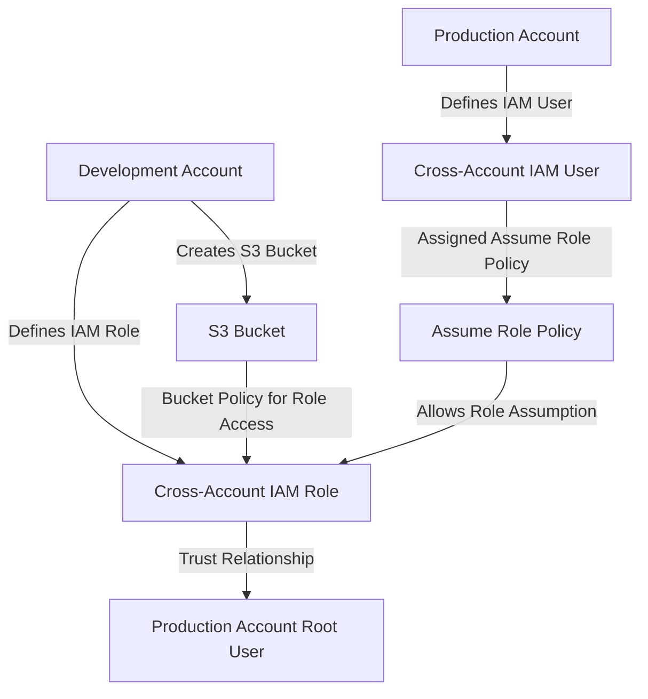

- [Overview](#overview)
- [Steps to setup CLI access](#steps-to-setup-cli-access)

# Overview


# Steps to setup CLI access
1. Configure the AWS CLI Profile
You need to configure the AWS CLI with a profile that can assume the cross-account role. This is typically done in your AWS configuration file, which is located at ~/.aws/config on Linux and macOS, or at C:\Users\USERNAME\.aws\config on Windows.

    Example Configuration:

    ```bash
    [profile cross]
    role_arn = arn:aws:iam::<DEV_ACCOUNT_ID>:role/<ROLE_NAME>
    source_profile = <BASE_PROFILE>
    region = <REGION>
    ```

    Replace <DEV_ACCOUNT_ID> with the AWS account ID where the cross-account role exists, <ROLE_NAME> with the name of the IAM role you wish to assume (e.g., dev-entechlog-data-cross-account-role), <BASE_PROFILE> with a profile that has permissions to assume this role, and <REGION> with the appropriate AWS region.

    Steps to Configure:
    - Open the AWS configuration file in a text editor.
    - Add the above configuration to the file, replacing placeholders with actual values.
    - Save and close the file.

1. Setting Up the Base Profile
The source_profile in the cross profile configuration refers to another profile that has credentials to assume the cross-account role. Ensure that this base profile is correctly set up with access keys.

    Example Base Profile Setup:
    ```bash
    [profile <BASE_PROFILE>]
    aws_access_key_id = <YOUR_ACCESS_KEY_ID>
    aws_secret_access_key = <YOUR_SECRET_ACCESS_KEY>
    region = <REGION>
    ```

1. Testing the Profile
To validate that the cross profile is correctly set up and can assume the cross-account role, use the AWS CLI to make a call that requires valid credentials.

    Test Command:
    ```bash
    aws sts get-caller-identity --profile cross
    ```

    This command should return details of the assumed role, including the account ID and the role ARN.

1. Accessing the S3 Bucket
Once you've confirmed the profile is working, you can use it to access resources in the other account. For example, to list the contents of the S3 bucket:

    ```bash
    aws s3 ls s3://<BUCKET_NAME> --profile cross
    ```
    Replace <BUCKET_NAME> with the name of your S3 bucket.