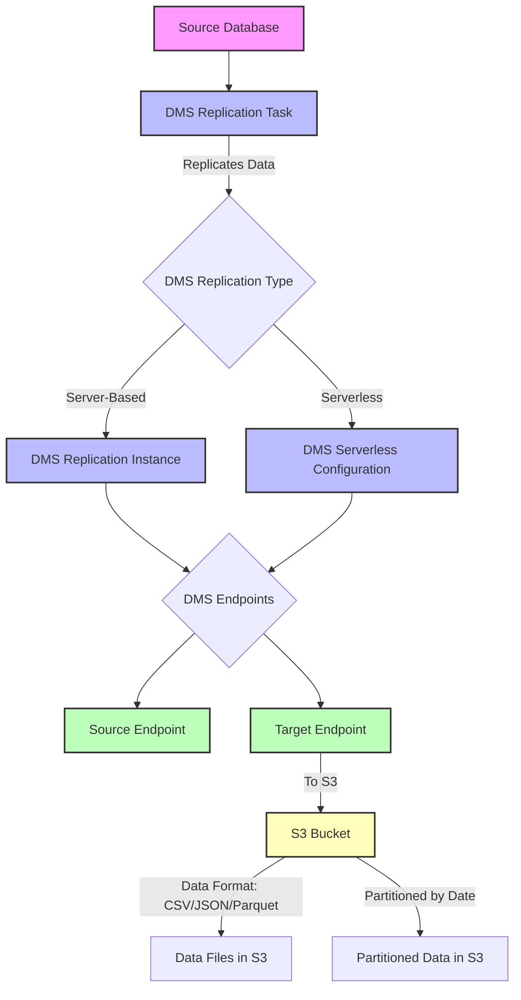

- [AWS DMS Terraform Module](#aws-dms-terraform-module)
  - [Overview](#overview)
  - [Diagram](#diagram)
  - [Diagram Description](#diagram-description)
  - [Usage](#usage)
  - [Connector API's](#connector-apis)
  - [Reference](#reference)


# AWS DMS Terraform Module

This Terraform module provides an easy way to set up AWS Database Migration Service (DMS) tasks and endpoints, including support for both server-based and serverless configurations. It supports various data formats such as CSV, JSON, and Parquet, and allows for flexible configuration of replication tasks and S3 endpoints.

## Overview

This module automates the creation and management of AWS DMS resources, including:

- **DMS Replication Instance** (for server-based DMS)
- **DMS Replication Task** (for migrating data between databases or from a database to S3)
- **DMS Replication Configuration** (for serverless DMS)
- **DMS Endpoints** (source and target, with support for S3 as a target)
- **Flexible data format settings** for S3 endpoints (CSV, JSON, Parquet)
- **Support for date partitioning** in S3 targets

## Diagram

Below is a diagram illustrating the architecture and the flow of data through the AWS DMS components:



## Diagram Description
- Source Database: The source database from which data is extracted.
- DMS Replication Instance: The server-based DMS instance that runs the replication task.
- DMS Replication Task: The task that manages the data migration process, which can be configured to replicate to S3.
- DMS Endpoints: Both source and target endpoints, with support for different target types, including S3.
- S3 Target Bucket: The destination for replicated data, with configurable data format and partitioning options.
- DMS Serverless Configuration: Optional serverless configuration for DMS, where no replication instance is required.

## Usage

```bash
module "dms_replication_server" {
  source = "../../aws-modules/dms"

  use_serverless              = false
  replication_instance_arn    = aws_dms_replication_instance.dms_replication_instance.arn
  replication_subnet_group_id = aws_dms_replication_subnet_group.dms_private_subnet_group.id

  source_engine_name          = "mysql"
  source_username             = "admin"
  source_password             = var.db_password
  source_server_name          = aws_db_instance.db_instance.address
  source_port                 = 3306
  source_identifier           = "demo"

  target_engine_name             = "s3"
  target_service_access_role_arn = aws_iam_role.dms_role.arn
  target_bucket_name             = "${local.dms_bucket_name}/server"
  target_identifier              = "server"

  target_data_format             = "parquet"
  target_date_partition_enabled  = true
  target_partition_sequence      = "yyyy/MM/dd"

  table_mappings = jsonencode({
    rules = [
      {
        rule-type = "selection"
        rule-id   = "1"
        rule-name = "1"
        object-locator = {
          schema-name = "demo"
          table-name  = "%"
        }
        rule-action = "include"
      }
    ]
  })

  replication_task_settings = jsonencode({
    TargetMetadata = {
      TargetSchema           = ""
      SupportLobs            = true
      FullLobMode            = false
      LobChunkSize           = 0
      LimitedSizeLobMode     = true
      LobMaxSize             = 32
      InlineLobMaxSize       = 0
      LoadMaxFileSize        = 0
      ParallelLoadBufferSize = 0
      BatchApplyEnabled      = false
    }
    Logging = {
      EnableLogging = true
    }
  })
}
```

## Connector API's
To monitor the status and information of the connectors, you can use the following API endpoints:

- http://localhost:8083/connectors?expand=status
- http://localhost:8083/connectors?expand=info

## Reference
This module was inspired by the following repositories:

- [AWS DMS Replication Task by James Woolfenden](https://github.com/JamesWoolfenden/pike/blob/5335593fecb902f906ac02dfcd5f8968125f4286/terraform/aws/backup/aws_dms_replication_task.tf)
- [UKHomeOffice DMS Serverless Terraform Module](https://github.com/UKHomeOffice/acp-tf-dms-serverless/tree/main)
