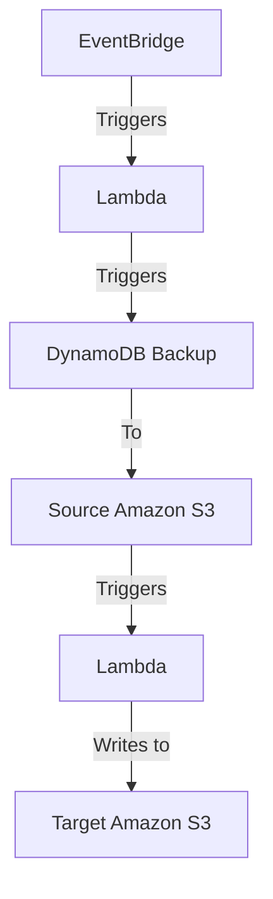

- [Overview](#overview)
- [Architecture](#architecture)
- [Reference](#reference)

# Overview
This repository contains a comprehensive guide and the necessary Terraform configurations to set up and demonstrate export from dynamoDB to AWS s3 bucket

# Architecture

# Reference
- https://dev.to/ritaly/how-to-export-aws-dynamodb-data-to-s3-for-recurring-tasks-4l47
- https://medium.com/@xinweiiiii/export-aws-dynamodb-data-to-s3-on-a-recurring-basis-using-lambda-198d290c8e64
- https://aws.amazon.com/blogs/storage/excluding-and-including-specific-data-in-transfer-tasks-using-aws-datasync-filters/