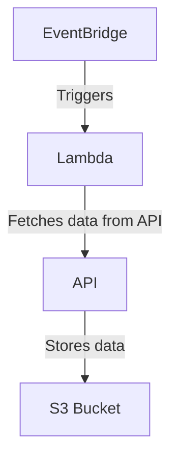

- [Overview](#overview)
- [Architecture](#architecture)
- [Steps](#steps)
- [Reference](#reference)

# AWS Lambda Data Pipeline: API to S3

## Overview
This repository provides a comprehensive guide and necessary configurations using Terraform to demonstrate an AWS Lambda function that fetches data from an API and stores it in an AWS S3 bucket upon being triggered by AWS EventBridge.

This guide assumes familiarity with AWS services such as Lambda, S3, and EventBridge, and tools like AWS CLI and LocalStack. For further details on AWS configurations and LocalStack setup, refer to the official AWS and LocalStack documentation.

## Architecture



## Steps to Set Up and Test

### Setting Up the S3 Bucket

- Check the health of localstack instance `http://localhost:4566/_localstack/health`
  
- Create a test S3 bucket using AWS CLI or LocalStack:

```bash
aws --endpoint-url=http://localstack:4566 s3api create-bucket --bucket dev-entechlog-landing-zone --region us-east-1
# Or using awslocal for simplicity
awslocal s3 mb s3://dev-entechlog-landing-zone
```

- Verify the S3 bucket creation:
```bash
aws --endpoint-url=http://localhost.localstack.cloud:4566 s3api list-buckets
```

### Deploying the Lambda Function
- Install dependencies and package the Lambda function:
```bash
pip install -r requirements.txt -t .
zip -r ../api2s3.zip .
```

- Create the Lambda function locally with the packaged code:
```bash
awslocal lambda create-function \
  --function-name get_pair_candles \
  --runtime python3.8 \
  --role arn:aws:iam::000000000000:role/lambda-role \
  --handler get_pair_candles.lambda_handler \
  --timeout 30 \
  --zip-file fileb://api2s3.zip
```

### Invoking the Lambda Function
- Example payload with an optional timestamp:
```bash
awslocal lambda invoke \
    --function-name get_pair_candles \
    --payload '{"BASE_URL": "https://community-api.coinmetrics.io/v4/timeseries", "ENDPOINT": "/pair-candles", "FREQUENCY": "1h", "PAGE_SIZE": 1000, "S3_BUCKET": "dev-entechlog-landing-zone", "S3_KEY_PREFIX": "source=coinmetrics/event_name=pair-candles", "BATCH_TIMESTAMP": "2024-04-20T18:00:00Z"}' \
    output.txt
```

### Monitoring and Testing
- Check Lambda function logs via the Docker container logs if using LocalStack
- Verify that files are correctly placed in the S3 bucket


### Alternate Testing Options 
Test the Lambda function locally using python-lambda-local
```bash
python-lambda-local -f lambda_handler get_pair_candles.py ./events/example_02.json -t 30
```

