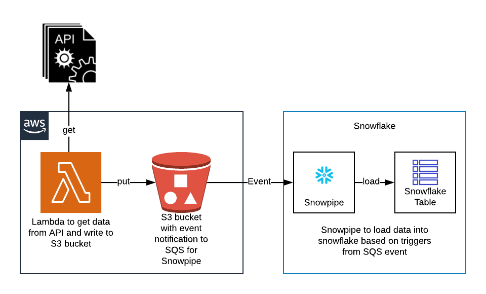

# sam-lambda-get-wx-data

## Overview
Demo for invoking api using AWS Lambda, writing to s3 and loading to snowflake using snowpipe

<p align="center">
  
</p>


## SAM commands
- SAM Build 
  ```
  sam build
  ```
- SAM 
  ```bash
  sam deploy --stack-name sam-lambda-get-wx-data --s3-bucket <sam-bucket-name> --capabilities CAPABILITY_NAMED_IAM --parameter-overrides paramIAMUserARN="arn:aws:iam::<san=m-user>"
  ```
- Delete the stack
  ```bash
  aws cloudformation delete-stack --stack-name sam-lambda-get-wx-data
  ```