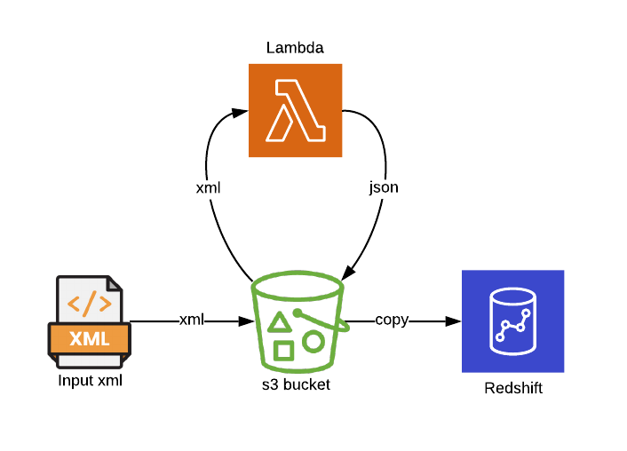

# sam-lambda-xml2json

## Overview
Demo for converting xml to JSON using AWS Lambda

<p align="center">
  
</p>

## SAM commands
- SAM Build 
  ```
  sam build
  ```
- SAM 
  ```bash
  sam deploy --stack-name sam-lambda-xml2json --s3-bucket <sam-bucket-name> --capabilities CAPABILITY_NAMED_IAM
  ```
- Delete the stack
  ```bash
  aws cloudformation delete-stack --stack-name sam-lambda-xml2json
  ```